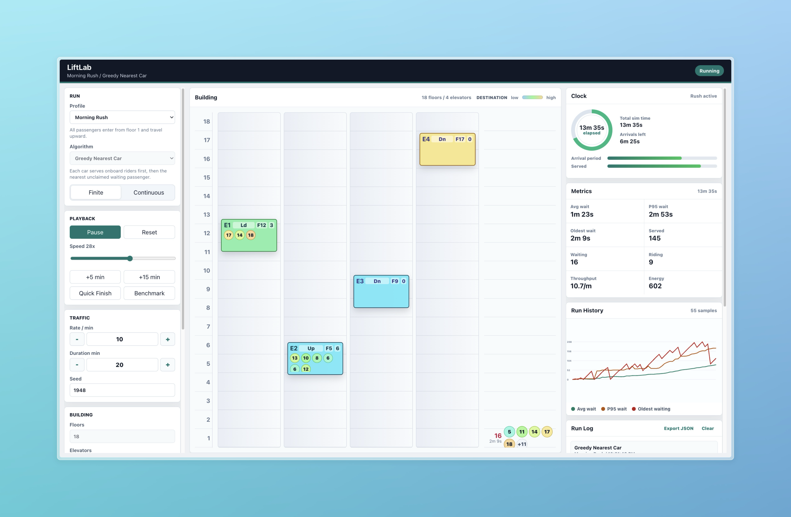

# LiftLab

LiftLab is a deterministic elevator simulation workbench for testing dispatch algorithms. The
project is organized around runs: every live simulation, fast-forward, and benchmark is a run with
the same config, engine, profiles, algorithm API, metrics, and history samples.



## What Changed

- Rebuilt the old canvas-driven prototype as a pure headless simulator plus a React console.
- Added finite and continuous run modes.
- Added configurable building size, capacity, traffic rate, duration, seed, and speed.
- Timing assumes 5m floors by default, with configurable car speed and door timings.
- Displayed floors are 1-based, while the engine keeps zero-based floor indexes internally for
  algorithm code.
- Algorithms can optionally assign waiting passengers to specific elevators for destination-dispatch
  workflows.
- Added demand profiles for morning rush, lunch rush, end-of-day, all-hands, steady traffic, and
  bursty mixed traffic.
- Added five algorithms: greedy, SCAN, zoned parking, lobby express, and destination batching.
- Added fast headless benchmarking and live metric history charts.
- Added local run saving plus JSON export for the full current run snapshot.

## Quick Start

```bash
npm install
npm run dev
```

The web app runs through Vite. Build everything with:

```bash
npm run build
```

Run a quick CLI comparison with:

```bash
npm run simulate
```

## Project Layout

```text
packages/sim   Pure TypeScript simulation engine, profiles, algorithms, benchmarks
packages/web   React/Vite simulator and benchmark console
docs           Architecture and API notes
```

## Adding An Algorithm

Add a file in `packages/sim/src/algorithms`, export an `ElevatorAlgorithm`, then register it in
`packages/sim/src/algorithms/index.ts`. Algorithms receive immutable snapshots and return target
floor plans. The engine owns movement, doors, boarding, capacity, passenger lifecycle, and metrics.

See [docs/API.md](docs/API.md) for the full contract.

Finite run duration controls the traffic arrival window. After that window closes, the engine keeps
running so the selected algorithm can drain the remaining queue.

## Deployment

The Vite config uses `/LiftLab/` as the production base path for GitHub Pages. The included Pages
workflow builds `packages/web/dist`. Vercel also works with the root build command `npm run build`
and output directory `packages/web/dist`.
